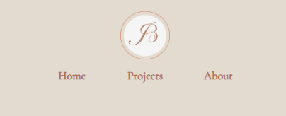
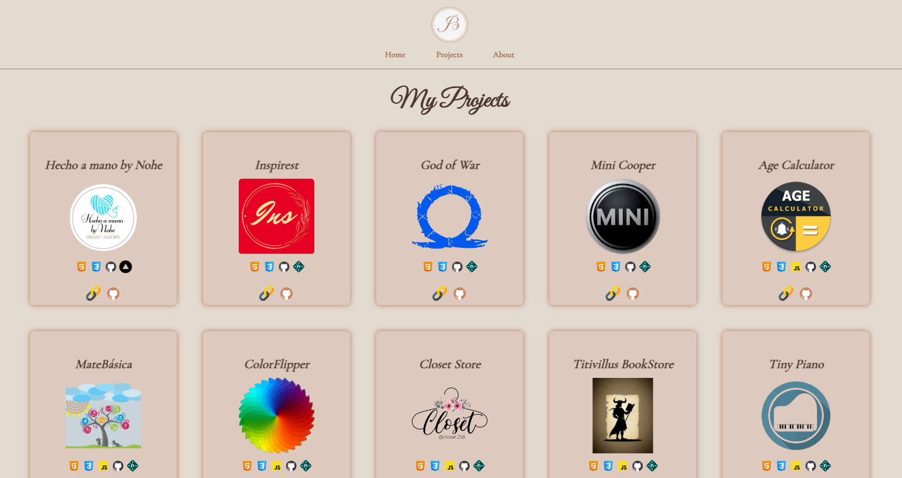
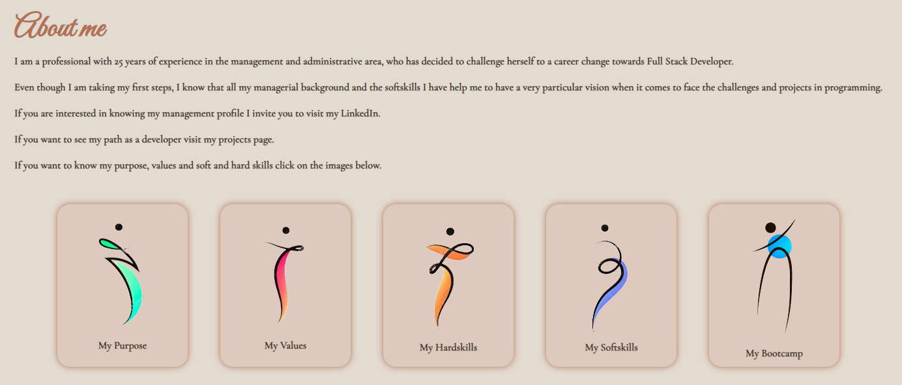

# Jeniffer Balabuch Web Developer Portfolio - 2024

Uncover my experience and skills as a web developer through these real-world projects. Browse my portfolio and explore concrete examples of my passion for creating websites that are both beautiful and efficient.

## Deployment

You can see the deployment here

[Portfolio JCBS](https://portfoliojcbs.netlify.app)

## Tech Stack

HTML, CSS, Javascript

## Features

- Navigation router

- Live previews

- Fullscreen mode

## Screenshots

## Authors

- [Jeniffer Balabuch](mailto:balabuchj@gmail.com) || [Linkedin](https://www.linkedin.com/in/jenifferbalabuch) || [Github](https://github.com/JCBalabuch)
